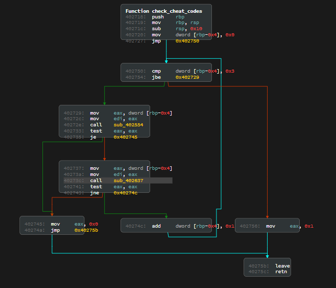
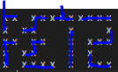

# blox1 - 84 solves (300 points)
## Description
```
We found an old arcade machine lying around, manufactured by the RET2 Corporation. Their devs are notorious for hiding backdoors and easter eggs in their games, care to take a peek?

https://wargames.ret2.systems/962c162fa1d2ea626d36/csaw_2020

(NOTE: The WarGames site itself is not in scope, just the Bl`ox Game. If you do find a security issue on the site, feel free to send it to us at support(at)ret2.io)
```

## First looks
When navigating to the provided link, we're given some windows, `Disassembly`, `Data`, `Source`, `Python`, `Shellcode` and `Debugger`  
Most of them are self explanatory, and we have a window on the left with some additional information. It reveals even more when clicking the `Disassembly` window:
```
Яeverse Ǝngineer
...
We've given the code a cursory glance... the check_cheat_codes function sounds highly suspicious...

You must flip the switch in the bottom right to "LIVE" to get the flag. This will disable the debugger when running
```
Also when going to the python window we can start the application.  
Playing around a bit, we find that it's obviously tetris and because of the previous hint we need to somehow enable the cheat codes (Confirmed by hovering over the little flags on the bottem right)...

## Reversing
When we simply check the `check_cheat_codes` function in the disassembler, we get some nice and *understandable* `assembly`:
```assembly
0x402718:  push    rbp
0x402719:  mov     rbp, rsp
0x40271c:  sub     rsp, 0x10
0x402720:  mov     dword [rbp-0x4], 0x0
0x402727:  jmp     0x402750
0x402729:  mov     eax, dword [rbp-0x4]
0x40272c:  mov     edi, eax
0x40272e:  call    sub_402554
0x402733:  test    eax, eax
0x402735:  je      0x402745
0x402737:  mov     eax, dword [rbp-0x4]
0x40273a:  mov     edi, eax
0x40273c:  call    sub_402637
0x402741:  test    eax, eax
0x402743:  jne     0x40274c
0x402745:  mov     eax, 0x0
0x40274a:  jmp     0x40275b
0x40274c:  add     dword [rbp-0x4], 0x1
0x402750:  cmp     dword [rbp-0x4], 0x3
0x402754:  jbe     0x402729
0x402756:  mov     eax, 0x1
0x40275b:  leave   
0x40275c:  retn    
```
We can already notice the `for` loop, but opening it in the graph view confirms this:  
  
Based on this we can also see that, either `sub_402554` or `sub_402554` needs to return `true` in order to continue the loop.  

### sub_402554
```asm
0x402554:  push    rbp
0x402555:  mov     rbp, rsp
0x402558:  mov     dword [rbp-0x14], edi
0x40255b:  mov     dword [rbp-0x4], 0x0
0x402562:  jmp     0x402626
0x402567:  mov     byte [rbp-0x5], 0x0
0x40256b:  mov     byte [rbp-0x6], 0x0
0x40256f:  mov     dword [rbp-0xc], 0x0
0x402576:  jmp     0x4025c9
0x402578:  mov     eax, dword [rbp-0x4]
0x40257b:  lea     esi, [rax+0xf]
0x40257e:  mov     edx, dword [rbp-0x14]
0x402581:  mov     eax, edx
0x402583:  add     eax, eax
0x402585:  add     edx, eax
0x402587:  mov     eax, dword [rbp-0xc]
0x40258a:  add     eax, edx
0x40258c:  mov     ecx, eax
0x40258e:  mov     edx, esi
0x402590:  mov     rax, rdx
0x402593:  add     rax, rax
0x402596:  add     rax, rdx
0x402599:  shl     rax, 0x2
0x40259d:  lea     rdx, [rax+rcx]
0x4025a1:  lea     rax, [rel board]
0x4025a8:  add     rax, rdx
0x4025ab:  movzx   eax, byte [rax]
0x4025ae:  test    al, al
0x4025b0:  je      0x4025c5
0x4025b2:  mov     eax, dword [rbp-0xc]
0x4025b5:  add     eax, 0x1
0x4025b8:  xor     byte [rbp-0x5], al
0x4025bb:  movzx   eax, byte [rbp-0x6]
0x4025bf:  add     eax, 0x1
0x4025c2:  mov     byte [rbp-0x6], al
0x4025c5:  add     dword [rbp-0xc], 0x1
0x4025c9:  cmp     dword [rbp-0xc], 0x2
0x4025cd:  jbe     0x402578
0x4025cf:  mov     ecx, dword [rbp-0x4]
0x4025d2:  mov     edx, dword [rbp-0x14]
0x4025d5:  mov     rax, rdx
0x4025d8:  shl     rax, 0x2
0x4025dc:  add     rax, rdx
0x4025df:  lea     rdx, [rax+rcx]
0x4025e3:  lea     rax, [rel data_403700]
0x4025ea:  add     rax, rdx
0x4025ed:  movzx   eax, byte [rax]
0x4025f0:  cmp     byte [rbp-0x5], al
0x4025f3:  jne     0x40261b
0x4025f5:  mov     ecx, dword [rbp-0x4]
0x4025f8:  mov     edx, dword [rbp-0x14]
0x4025fb:  mov     rax, rdx
0x4025fe:  shl     rax, 0x2
0x402602:  add     rax, rdx
0x402605:  lea     rdx, [rax+rcx]
0x402609:  lea     rax, [rel data_403730]
0x402610:  add     rax, rdx
0x402613:  movzx   eax, byte [rax]
0x402616:  cmp     byte [rbp-0x6], al
0x402619:  je      0x402622
0x40261b:  mov     eax, 0x0
0x402620:  jmp     0x402635
0x402622:  add     dword [rbp-0x4], 0x1
0x402626:  cmp     dword [rbp-0x4], 0x4
0x40262a:  jbe     0x402567
0x402630:  mov     eax, 0x1
0x402635:  pop     rbp
0x402636:  retn
```
The function is not that big and we can simply reverse it, but at this point I decided to look at the debugger a bit.  

#### Debugger
The debugger provides us with some interesting features, similair to normal `gdb`:
```
wdb> help
Valid Commands are:
...
break:    Set a breakpoint at a given address or symbol
continue:    Continue running the program with the current context
...
start:    Run the current program and automatically break on main
x:    View memory or register-values in a variety of formats
vmmap:    View all mapped memory pages and their properties
```
I decided to just run `start` and `vmmap` afterwards:
```
0x400000-0x405000 rwx csaw2020_blox
0x7ffffffde000-0x7ffffffff000 rw- [stack]
```
Using the `x` command we can leak the binary: `x/20480x 0x400000`, after this (and reversing the bytes' order), we have the binary and we can load it up in our disassembler of choice, I chose Ghidra, since it's free, but ida works just as well.  
Since we don't have any symbols, we can rename the functions and variables, which we can just copy from the original `assembly` from the integrated `disassembler`  
However, 2 hours before the CTF ended, they just released the full binary with symbols, because there were some issues regarding speed on the online service, so I'll be using that one for now.  
Thanks to this version, we know what the function is called: `check_rows` and we get some nice decompiled source:
```csharp
uint check_rows(uint blk)
{
  uint x;
  uchar sum;
  uchar xor;
  uint y;
  
  y = 0;
  while( true ) {
    if (4 < y) {
      return 1;
    }
    xor = '\0';
    sum = '\0';
    x = 0;
    while (x < 3) {
      if (board[(ulong)(y + 0xf) * 0xc + (ulong)(x + blk * 3)] != '\0') {
        xor = xor ^ (char)x + 1U;
        sum = sum + '\x01';
      }
      x = x + 1;
    }
    if ((xor != rxors[(ulong)blk * 5 + (ulong)y]) || (sum != rsums[(ulong)blk * 5 + (ulong)y]))
    break;
    y = y + 1;
  }
  return 0;
}
```
*Here we can also see how poorly ghidra is able to understand 2d arrays..*  
However, looking at this code, we see that there is some check whether there is a piece at the board given a location `(y, x)` and if there is, it's XORing `xor` with `x + 1`, it also adds `1` to the `sum` and it checks this 3 times.  
At the end it checks whether the `xor` value equals some constant in memory and whether the `sum` value equals another constant in memory. For this we can write a simple solver, I originally did this in `JS` because I could just copy most of the code, but here it is again in python:  

```python
board = {}

rxors = [3, 2, 3, 2, 2, 0, 1, 3, 1, 0, 0, 2, 2, 2, 2, 0, 3, 0, 1, 0, 0, 0, 0, 0]
rsums = [2, 2, 2, 2, 2, 3, 1, 2, 1, 3, 3, 1, 1, 1, 1, 3, 1, 3, 1, 3, 0, 0, 0, 0]


NROWS = 20
NCOLS = 12

for y in range(NROWS):
    for x in range(NCOLS):
        board[y,x] = 0

def check_rows(blk):
    result = True

    for y in range(5):
        xor = 0
        sum = 0

        targetSum = rsums[blk * 5 + y]
        targetXor = rxors[blk * 5 + y]

        if targetSum == 3:
            for x in range(3):
                board[y + 0xf, x + blk * 3] = 1
        elif targetSum == 2:
            if targetXor == 1:
                board[y + 0xf, 1 + blk * 3] = 1
                board[y + 0xf, 2 + blk * 3] = 1
            elif targetXor == 2:
                board[y + 0xf, 0 + blk * 3] = 1
                board[y + 0xf, 2 + blk * 3] = 1
            elif targetXor == 3:
                board[y + 0xf, 0 + blk * 3] = 1
                board[y + 0xf, 1 + blk * 3] = 1
        elif targetSum == 1:
            board[y + 0xf, (targetXor - 1) + blk * 3] = 1

        for x in range(3):
            if (y + 0xf, x + blk * 3) in board and board[y + 0xf, x + blk * 3] != 0:
                xor ^= (x + 1)
                sum += 1
        
        if xor != rxors[blk * 5 + y] or sum != rsums[blk * 5 + y]:
            result = False
            break

    return result

for i in range(4):
    check_rows(i)

for y in range(NROWS):
    res = ""
    for x in range(NCOLS):
        if board[y,x] == 0:
            res += " "
        else:
            res += "X"
        res += " "
    print(res)
```

Which gives this output:
```
X X   X X X X X X X X X
X   X X       X       X
X X   X X     X   X X X
X   X X       X   X
X   X X X X   X   X X X
```
and since the check is an `OR`, we don't have to check the `sub_402637` (`check_cols`). *However `sub_402637` gives the exact same result.*  
So we need to somehow get this pattern, at this point, I let the challenge be for like 10 hours, until the next morning, a teammember actually got this pattern by just playing the game. And we got the flag.  
However, I still wanted to solve it, so I decided to puzzle a bit, also because we thought we need the cheatcodes for `blox2`.

### Puzzling
Since we needed a pattern such as:  
  
*(There are more patterns like this)*  
From just playing around a bit, we noticed that we get the same pieces at the start when we reset, this means that we have to break the random generator, so we go back to reversing.  
We also notice that in the given source, this is being called: `#define RAND_MINO() (1+rand()%NTTR_TYPES)` and at the start of main: `srand(1);` is being called, which presumably sets the inital random number to `1`?  
In our decompiler, the `rand` function looks something like this:
```csharp
int rand(void)
{
  g_rand_state = g_rand_state * 0x41c64e6d + 0x3039U & 0x7fffffff;
  return g_rand_state;
}
```
And `srand`:  
```csharp
void srand(int s)
{
  g_rand_state = s;
  return;
}
```
By simply implementing this, we can predict all figures:
```python
def rand(state):
    return (0x41C64E6D * state + 12345) & 0x7FFFFFFF

TTR_I = 1
TTR_J = 2
TTR_L = 3
TTR_O = 4
TTR_S = 5
TTR_Z = 6
TTR_T = 7

figs = {
    TTR_I: "I",
    TTR_J: "J",
    TTR_L: "L",
    TTR_O: "O",
    TTR_S: "S",
    TTR_Z: "Z",
    TTR_T: "T",
}
res = ""
state = 1
for i in range(100):
    state = rand(state)

    current = state % 7 + 1
    res += figs[current] + " "

print(res)
```

From here, we need to puzzle, so we start by looking for some simple starts I noticed this one:
```
J I S Z I T S
x x x c x x x
```
By using the `c` (store) function, we can eliminate the `Z`, so we can build our chain.  
*Note, before this I got stuck on one, because I just couldn't get the last piece to fit and the towers were getting too large*  
And for another one, the debugger had different speeds, so precise movements were impossible, I complained about this at `6:31 PM` and they released the full binary at `9:07 PM`...  
Full script:
```python
p = interact.Process()

def enableCheats():
    p.sendline("")

    for i in range(2):
        p.send(" "*12)
        
        p.sendline("AAA")
        p.sendline("")

    p.send("waaaaa ")
    p.send("aaa " * 2)
    p.send("c")
    p.send("ddw ")
    p.send("waaaaa ")
    p.send("aaa ")
    p.send("aaaaa " * 2)
    p.send("waaaaa "*3)
    p.send("waaa "*4)
    p.send("wa ")
    p.send(" " * 2)
    p.send("ddddd " * 2)
    p.send(" ")
    p.send("ddddd ")
    p.send(" "*5)
    p.sendline("AAA")
    p.sendline("")


enableCheats()
p.interactive()
```
Which running in live mode gives us the flag:  
`flag{c0ngr4ts_0n_y0ur_S3cr3t_Gr4de_GM}`


#### Small side note
Running this in the console will light up the little flags in the bottom right of the debugger tab without getting a flag:
```js
$.ajax({
    url: "/level/checkpoint/update",
    headers: {
        "X-CSRF-TOKEN": document.cookie.split("_csrf=")[1]
    },
    method: "POST",
    data: JSON.stringify({
        level: "csaw2020_blox",
        checkpoint: 5 //and 6
    }),
    contentType: "application/json"
})
```