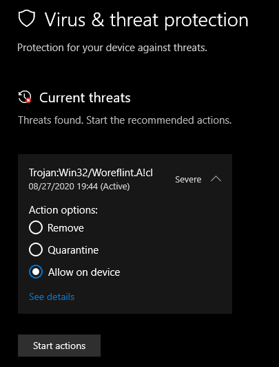
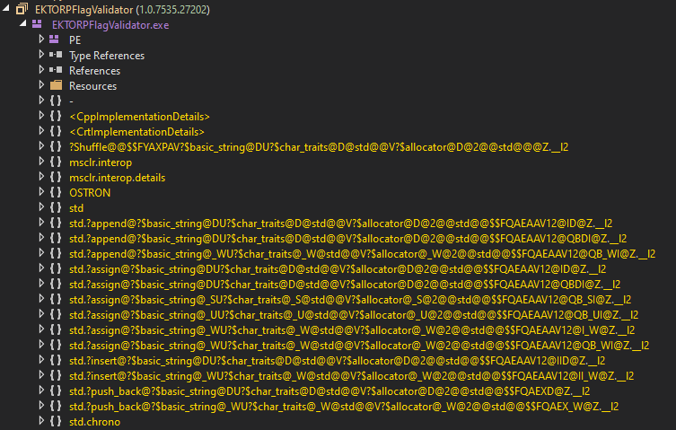
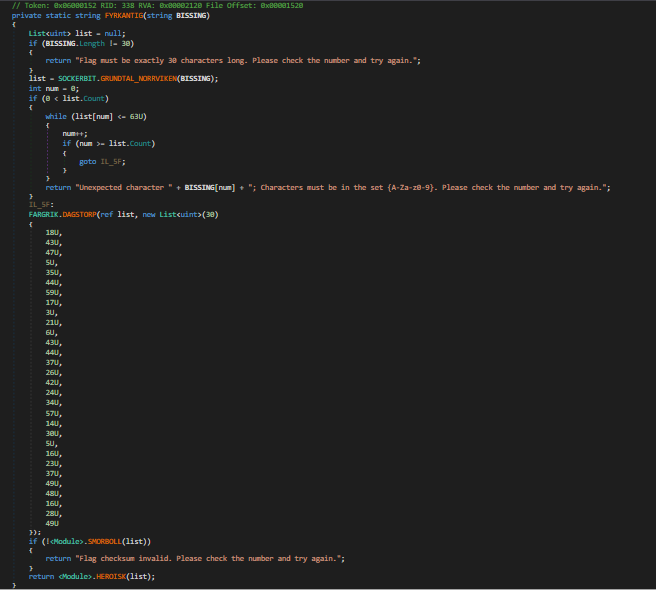
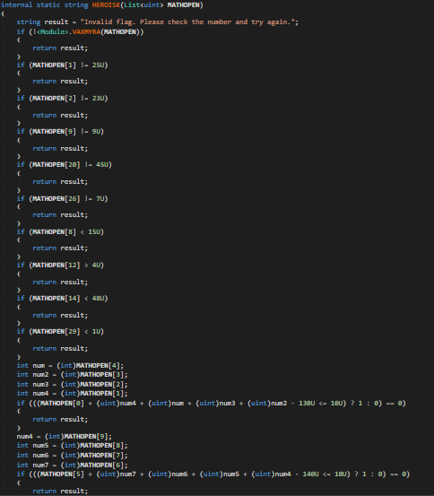
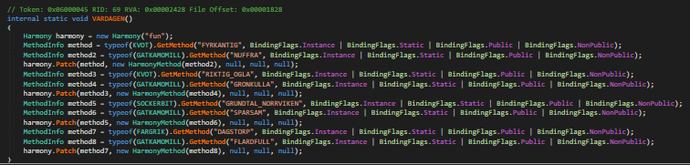
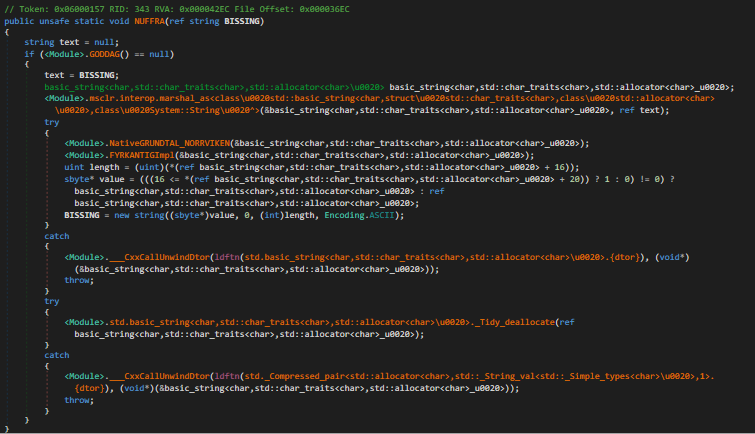
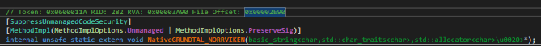
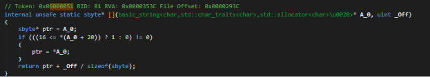
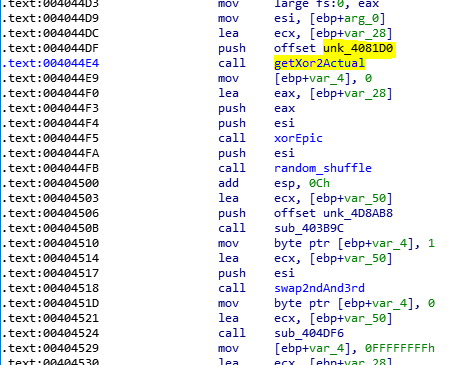

# .net

Description:
```
.NET is great, especially because of all its weird features.
```

*Note: Windows defender didn't like the challenge*:  
  

## First looks
When first starting the challenge, we are provided with some input field with a button  
When we try some random input, we first get an error saying our input is too short and when we try a large enough input, we get an invalid *checksum*  
Also we're given 2 files, a `README` which just said it was targeting `.NET Framework v4.5.2` and a LICENSE. There is also this `0Harmony.dll` file and after a bit of googling, we find out that it's `A library for patching, replacing and decorating .NET and Mono methods during runtime` *Amazing*.

## Reversing
Because of the challenge name and because of the obvious win form, I decided to load it up in dnSpy and see what's happening  
  
It's immediately clear that there is probably going to be some x86 involved..  
However, after a bit of more looking around we find the `Form` with the `submit` handler which calls this function to verify everything:  
  
Here we can see some calls to functions:
```
SOCKERBIT.GRUNDTAL_NORRVIKEN: Converts the input string to a list of uints with DecodeBase64Bytewise characters, starting from 0-9 being 0-9, A-Z being 10-35 and a-z being 36-61
DAGSTORP: Simple XOR
SMORBOLL: Checksum check
HEROISK: Some simple checks
```
So after this I decided to create a `HEROISK` solver with z3.  

### HEROISK
  
The function starts with the `VAXMYRA` check, which just checks if there are any duplicates in the `MATHOPEN` list  
After this there are some simple checks and after that there is a chain of checks we can simply implement, since there were a lot of checks I decided to write a simple script to extract them.  
However, I initially made the mistake by forgetting the `uint`'s and I had to modify the checks a bit:
```
flag0 + flag1 + flag4 + flag2 + flag3 - 130U <= 10,
```
becomes:
```
flag0 + flag1 + flag4 + flag2 + flag3 <= 140,
flag0 + flag1 + flag4 + flag2 + flag3 >= 130,
```
After having implemented this and the checksum function in python, I ran the `solve.py` and got the `YouMissedSomethingImportantCpp`. Clearly I missed something and I had not seen anything yet regarding the `cpp` stuff, so here we go again...

### CPP
After a bit more looking around in dnSpy (and debugging), I found this function:
  
Here it uses the `0Harmony.dll` to prefix certain methods, so another function will be called first instead of the original.  
The first function I saw already looked quite weird:  
  
At this point I was a bit lost and ended up opening the binary in ida and with the given file offset from dnSpy:  
  
of those weird functions I was able to disassemble them. However, I didn't really know what to do and with the offset in ida I was able to debug it in `x32dbg`, I simply opened the binary in `x32dbg` and put a breakpoint at the start of one of those functions (`Using cntrl + shift + g for file offset`), here I found that the `NativeGRUNDTAL_NORRVIKEN` function is basically the same as the original `GRUNDTAL_NORRVIKEN` function.  
At this point I was completely stuck and was just looking around at the `FYRKANTIGImpl` function in ida, but it made some weird calls, which I didn't understand, such as a jump to `0x6000051`.  
It wasn't until a team member messaged me asking if I could use some help. It was at that moment that these jumps to `0x6000051` for example were actually just calls to the `.net` code to functions with the specified token:  
  
And after a bit of debugging and looking around in ida and ghidra, I found some XOR function and I quickly found the key:  
  
After this I again got a bit stuck, but found out about two other functions which modified the input by simply following the `FYRKANTIGImpl` function and it's nested function calls in `x32dbg`.  
The same team member mentioned that first one was probably some random shuffling algorithm, and the last function was really simple to reverse as it just swapped characters in a for loop, being incremented by 3, but not taking the 27th and 28th character pseudo code:
```csharp
for (int i = 0; i < flag.length; i+=3) {
    if (i != 27 && i != 28) {
        int cache = flag[i];
        flag[i] = flag[i+1];
        flag[i+1] = cache;
    }
}
```
For the shuffling function, we came up with the idea to create a simple dictionary as the result was always the same (Because the same seed was used...). I created this by comparing the before and after using `x32dbg`:
Before:
```
01120490  3E 02 1E 1E 3A 26 16 00 25 12 28 1A 18 09 11 2D  >...:&..%.(....-  
011204A0  2F 0F 1E 04 0B 06 1F 2A 06 3D 19 10 3F 1C 00 00  /......*.=..?...  
```
After:
```
01120490  18 1E 3A 06 3E 1F 2D 1A 2A 26 10 28 04 16 0B 2F  ..:.>.-.*&.(.../  
011204A0  12 06 02 25 00 0F 19 3D 09 1E 1E 11 3F 1C 00 00  ...%...=....?...  
```
with this I created a script to create a dictionary with the given output and after some more tries (because of duplicate entries), we got a full dictionary.  
Now we have everything to solve the challenge, we only need to implement in in reverse, so first the `z3 solve -> swap -> reverse shuffle -> xor -> encode base64`.  
I originally created the solver in C# (except for the z3 stuff), because I could simply copy methods from dnSpy, but I made some mistake with references and it took me some time to figure out what I was doing wrong, it turned out I forgot to clone the object, but instead created a reference to the object, so I lost the original one..  
The final solver is `solve2.py`  

### Result
`CTF{CppClrIsWeirdButReallyFun}`