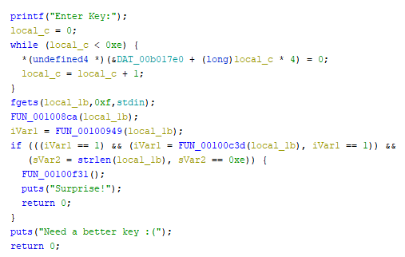
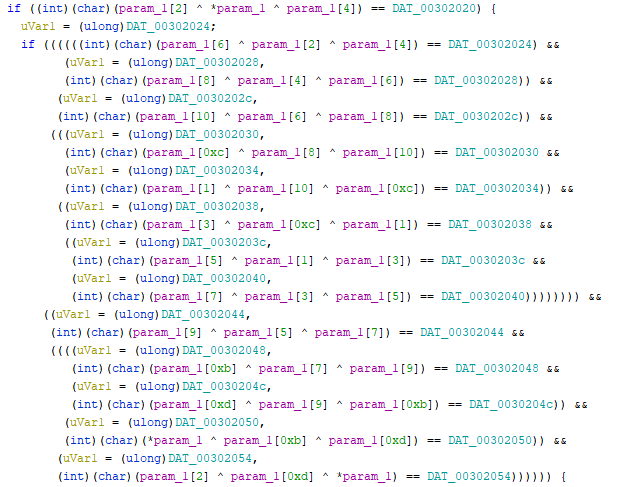
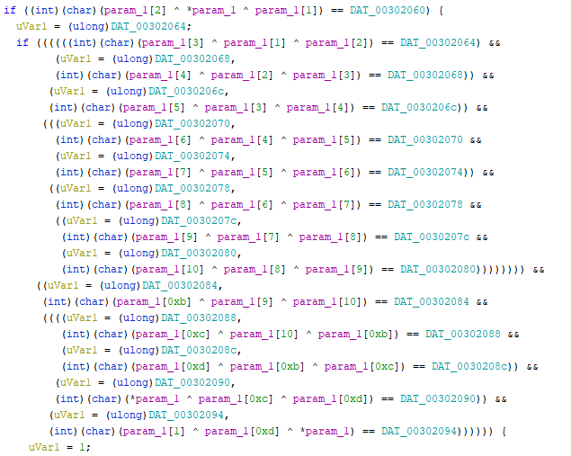
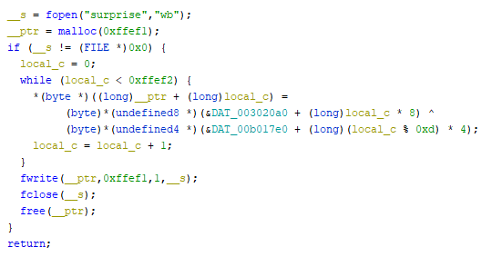

# ArchRide

## First looks

When running file on the provided: `surprise` file. We find out its bzip2 and after decompressing it and again running `file` on it we can see it's a 64 bit `x86` binary.  
After opening it, it asks for a key: `Enter Key:` and after ending some random characters it says it needs a better key: `Need a better key :(`  
However, we notice that the file is rather large: `8200kb`  

## Reversing

After finding out that we had to enter some key, I decided to load the binary up in `Ghidra` (It's free and opensource)  
Thankfully, the binary is small and just has a few functions, though the binary is stripped.  
Checking some random functions, we can see some function which looks like the main function:  
  
So basically, we need to satisfy 3 conditions.  

1. Our key is 14 characters (0xe - the null byte or line terminator)  
1. Some huge if case with a lot of XOR operations:  
  
1. A function which is really similair to the other if case:  
  

I decided I to just write some code to satisify those 2 conditions:

```python
from z3 import *
x0 = BitVec('x0', 32)
x1 = BitVec('x1', 32)
x2 = BitVec('x2', 32)
x3 = BitVec('x3', 32)
x4 = BitVec('x4', 32)
x5 = BitVec('x5', 32)
x6 = BitVec('x6', 32)
x7 = BitVec('x7', 32)
x8 = BitVec('x8', 32)
x9 = BitVec('x9', 32)
x10 = BitVec('x10', 32)
x11 = BitVec('x11', 32)
x12 = BitVec('x12', 32)
x13 = BitVec('x13', 32)

s = Solver()
s.push()
s.add(x4 ^ x0 ^ x2 == 0x6E,
x4 ^ x2 ^ x6 == 0x6E,
x6 ^ x4 ^ x8 == 0x5B,
x8 ^ x6 ^ x10 == 0x7E,
x10 ^ x8 ^ x12 == 1,
x12 ^ x10 ^ x1 == 0x32,
x1 ^ x12 ^ x3 == 0x47,
x3 ^ x1 ^ x5 == 0x25,
x5 ^ x3 ^ x7 == 0x27,
x7 ^ x5 ^ x9 == 0x7F,
x9 ^ x7 ^ x11 == 0x67,
x11 ^ x9 ^ x13 == 0x6D,
x13 ^ x11 ^ x0 == 0x4E,
x0 ^ x13 ^ x2 == 0x44,


x1 ^ x0 ^ x2 == 0x4C,
x2 ^ x1 ^ x3== 0x37,
x3 ^ x2 ^ x4== 0x15,
x4 ^ x3 ^ x5== 0x07,
x5 ^ x4 ^ x6== 0x7C,
x6 ^ x5 ^ x7== 0x5C,
x7 ^ x6 ^ x8== 0x7B,
x8 ^ x7 ^ x9== 0x58,
x9 ^ x8 ^ x10== 0x5D,
x10 ^ x9 ^ x11== 0x62,
x11 ^ x10 ^ x12== 0x3E,
x12 ^ x11 ^ x13== 0x31,
x13 ^ x12 ^ x0== 0x34,
x0 ^ x13 ^ x1== 0x42)
s.check()
print(chr(s.model().eval(x0).as_long()) + chr(s.model().eval(x1).as_long())  + chr(s.model().eval(x2).as_long()) + chr(s.model().eval(x3).as_long())+ chr(s.model().eval(x4).as_long())+ chr(s.model().eval(x5).as_long())+ chr(s.model().eval(x6).as_long())+ chr(s.model().eval(x7).as_long())+ chr(s.model().eval(x8).as_long())+ chr(s.model().eval(x9).as_long())+ chr(s.model().eval(x10).as_long())+ chr(s.model().eval(x11).as_long())+ chr(s.model().eval(x12).as_long())+ chr(s.model().eval(x13).as_long()))
```

Which resulted in `JCE1aWJApiDO5K` and after entering as the key, it creates a new binary (Also decompressed with gzip2), but with a different architecture: `32 bit x86`. Luckily the xor conditions stayed the same (except for the final values), so all that had to be done was write some code which retrieves the two xor keys and the new binary.  
To extract the xor keys, I just manually looked up all the locations of the xor keys in the binary as they were constant for each different architecture.  
Originally, I wanted to get the new binary by just entering the key into the process, but due to some issues with qemu (powerpc64..), it didn't work at all and I decided to just decrypt the new binary by itself.  
So I had to get back to Ghidra and findout how the decryption worked:  
  
This is just a simple XOR decryption which can be easily implemented.  
Thankfully, in `BZIP2` there is an `End Of Stream` magic, which is `0x177245385090` ([Wikipedia](https://en.wikipedia.org/wiki/Bzip2#File_format)) and so it stops at that point and doesn't care about the garbage after it. This allows us to just simply find the start of each encoded blob and we don't have to deal with the end. So we just cut everything before the start of the blob and pass it into the decrypt function.  

Note: _I made a small mistake in the xor decryption, by just implementing a normal alorithm, but noticed the `0xd` in the decryption function after some debugging. Initially I just implemented it as `len(key)` which is 14 instead of 13._

## Result
After running the `solve.py` for some time it crashes and we can execute the final `./surprise` which results in the flag:  
`inctf{x32_x64_ARM_MAC_powerPC_4rch_maz3_6745}`