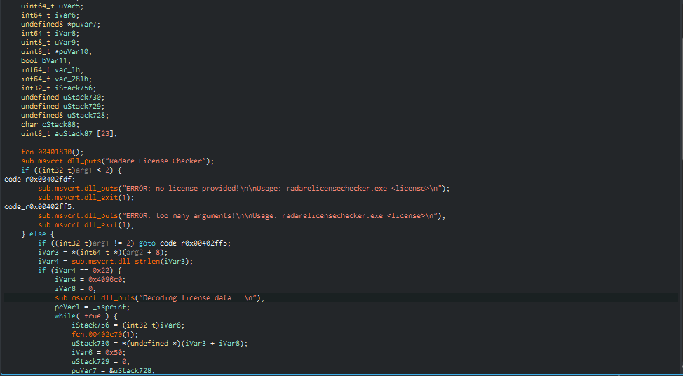

# raderelicensechecker

## First looks
When first starting the executable, we immediatly get an error:
```
Radare License Checker
ERROR: no license provided!

Usage: radarelicensechecker.exe <license>
```
And after entering some random license, we find out it's the wrong length and so after a bit of trial and error, we find out the license has to be 34 characters:
```
❯ .\radarelicensechecker.exe AAAAAAAAAAAAAAAAAAAAAAAAAAAAAAAAAA
Radare License Checker
Decoding license data...


ERROR: decryption error in block 0!
```
So clearly there's something going on and I decided to change the first A into an `r` because that's what the flag looks like, and we're lucky it failed at block `0` instead of block `1`:
```
❯ .\radarelicensechecker.exe rAAAAAAAAAAAAAAAAAAAAAAAAAAAAAAAAA
Radare License Checker
Decoding license data...

*Some random text here*

ERROR: decryption error in block 1!
```
However, it took like 2 seconds to verify this.

## Reversing
Opening up the executable in *cutter* (Because all challenges have to be solved using `radare2`) and looking around the functions, we find the `main` function:  
  
Looking at the `fcn.00402c70` function, we see that it's just a sleep function:
```
undefined8 fcn.00402c70(undefined8 dwMilliseconds)
{
    (*_Sleep)((int32_t)dwMilliseconds * 1000);
    return 0;
}
```
Let's patch that out (Right click -> edit -> instruction and allow to open in writemode) ->  
  
Now, the binary has been immediately patched and we just have to close cutter and open the binary again.  
Trying again:
```
❯ .\radarelicensechecker.exe r2cAAAAAAAAAAAAAAAAAAAAAAAAAAAAAAA
Radare License Checker
Decoding license data...

*Some random text here*

ERROR: decryption error in block 3!
```
Now, it prints this without sleeping, so now we only need to bruteforce the right key, since we know whether out key is correct because of the `ERROR: decryption error in block 3!`.  
So after writing some really simple code in `solve.py` we find the correct license key / flag in around 10 seconds:
```
❯ python .\solve.py
[34] FOUND FLAG: r2con{D0nt_Do_Crypt0_At_Hom3_Kids}
```
Also it prints some ascii art when running the exe with the flag  
`r2con{D0nt_Do_Crypt0_At_Hom3_Kids}`